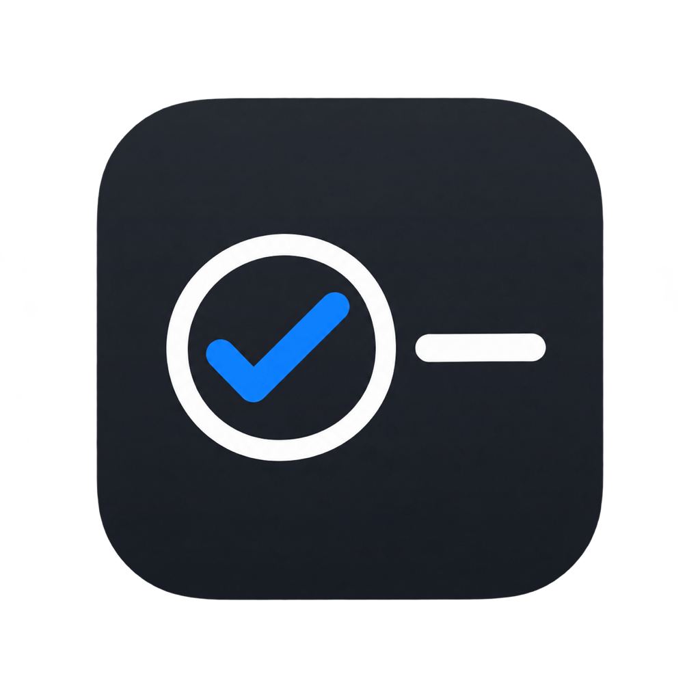
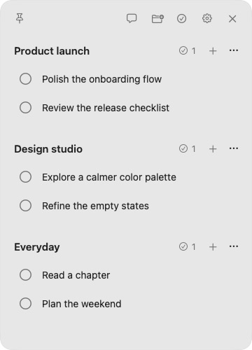
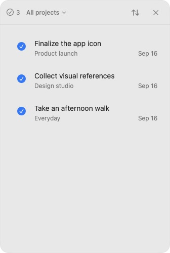

<p align="center">
  
</p>

<h1 align="center">FloatTask</h1>

<p align="center">
  작업에 집중하는 작은 macOS 태스크 패널.<br>
  프로젝트와 할 일을, 언제나 가까이에.
</p>

<p align="center">
  <a href="README.md">English</a> · <strong>한국어</strong>
</p>

<p align="center">
  <a href="#시작하기">시작하기</a> ·
  <a href="#주요-기능">주요 기능</a> ·
  <a href="#cli와-자동화">CLI</a> ·
  <a href="#개발">개발</a>
</p>

<p align="center">
  
  
</p>

<p align="center"><sub>샘플 데이터로 촬영한 실제 앱 화면입니다. 왼쪽은 진행 중인 Task, 오른쪽은 완료 목록입니다.</sub></p>

FloatTask는 현재 작업 화면 옆에 간결한 할 일 목록을 띄웁니다. 다른 앱 위에 고정하거나 필요한 곳으로 옮기고, 메뉴바 클릭으로 잠시 숨길 수 있습니다. 완료한 일은 메인 목록에서 사라지고 별도 이력에 남습니다.

**SwiftUI + AppKit**으로 구현한 네이티브 앱이며, **로컬 JSON 파일**을 **`floattaskctl` CLI**와 함께 사용합니다. 기본적인 프로젝트·Task 관리는 계정이나 네트워크 연결 없이 동작합니다.

## 주요 기능

| 기능 | 설명 |
| :--- | :--- |
| **작은 작업 공간** | 프로젝트와 Task 중심의 구조, 바로 편집하는 제목, 키보드 연속 입력, 위치와 크기를 기억하는 패널. |
| **항상 가까이에** | 모든 Space에서 다른 앱 위에 고정하거나, Dock·Mission Control에 표시되는 일반 창으로 전환. |
| **간결한 목록** | 긴 제목은 마우스를 올리면 펼쳐집니다. 완료한 Task는 숨기고 프로젝트 옆에 체크 원과 실제 개수만 표시합니다. |
| **완료 이력** | 별도 패널에서 프로젝트별 필터, 최근 완료순·추가한순 정렬, 한 번의 클릭으로 Task 재개. |
| **선택형 Codex 채팅** | 자연어로 Task 관리, 한국어·영어 답변 선택, 채팅과 완료 패널 동시 사용. |
| **공용 CLI** | JSON 출력과 동일한 저장소를 이용한 프로젝트·Task 생성, 이름 변경, 완료, 재개, 삭제. |

시스템 외관, SF Symbols, 키보드 단축키, 접근성 레이블, 모션 감소 설정을 지원합니다. Settings에는 **Show in menu bar**, **Keep on top**, **Reply language** 세 가지만 제공합니다.

## 시작하기

### 요구사항

- **macOS 14 이상**.
- macOS SDK와 **Swift 6.1**을 제공하는 Apple 개발 도구. 검증된 빌드 환경 기준이며, 패키지는 Swift 5 언어 모드를 사용합니다.
- **선택 사항:** 채팅을 사용하려면 호환되는 Codex CLI와 로그인이 필요합니다. 기본 태스크 패널은 Codex 없이도 사용할 수 있습니다.

### 소스에서 빌드

```bash
git clone https://github.com/EunHyeokJung/FloatTask.git
cd FloatTask
./scripts/build-app.sh
open dist/FloatTask.app
```

빌드가 끝나면 두 가지 결과물이 생성됩니다.

- `dist/FloatTask.app` — macOS 앱.
- `dist/floattaskctl` — 명령줄 인터페이스.

Finder에서 앱을 응용 프로그램 폴더로 복사해도 됩니다. 빌드 스크립트는 로컬 **ad-hoc 서명**을 생성하며, Developer ID 서명이나 공증된 배포본을 만들지는 않습니다. 위 안내는 사전 빌드된 릴리스 없이 소스에서 직접 실행하는 방법입니다.

### 기본 사용법

1. 폴더 추가 버튼으로 프로젝트를 만든 뒤, 프로젝트의 **+** 버튼으로 Task를 추가합니다.
2. 제목을 클릭하면 바로 편집합니다. Task에서 Enter를 누르면 저장한 뒤 다음 입력 행이 열립니다.
3. 원형 버튼으로 Task를 완료합니다. 프로젝트의 완료 개수나 헤더의 체크 원 버튼을 누르면 이력을 볼 수 있습니다.
4. 핀으로 창 모드를 전환합니다. 헤더의 빈 공간을 드래그하면 이동하고, 테두리나 모서리를 드래그하면 크기가 바뀝니다.
5. Settings에서 **Show in menu bar**를 켜면 메뉴바 클릭으로 숨김·표시를 전환합니다. 열려 있던 보조 패널도 함께 복원됩니다. 헤더의 **X는 숨김이 아니라 앱 종료**입니다.

| 단축키 | 동작 |
| :--- | :--- |
| `⌘N` | 첫 번째 프로젝트에 Task 추가 |
| `⌘⇧N` | 프로젝트 추가 |
| `⌘⇧C` | 완료 목록 열기 |
| `⌘,` | Settings 열기 |
| `Esc` | 보조 패널 닫기 또는 새 Task 입력 취소 |

## Codex 채팅

설치된 Codex CLI에 로그인한 다음, FloatTask의 말풍선 버튼을 누릅니다.

```bash
codex login
```

요청 예시:

> Product launch에 ‘릴리스 체크리스트 검토’ 추가해줘.
>
> ‘앱 아이콘 확정’을 완료 처리해줘.
>
> Design studio에 남은 작업을 보여줘.

앱은 **`gpt-5.6-luna`**, **`xhigh`** reasoning 설정으로 요청합니다. 설치된 CLI와 계정에서 해당 모델과 연동에 사용된 옵션을 지원해야 합니다. 이 값은 현재 Settings가 아니라 [`CodexTaskAgent.swift`](Sources/FloatTaskCore/CodexTaskAgent.swift)에 고정되어 있습니다. 다른 경로의 실행 파일은 앱 실행 환경의 `FLOATTASK_CODEX_PATH`로 지정할 수 있습니다.

봇 답변은 기본 **한국어**이며 Settings에서 **English**로 바꿀 수 있습니다. 고정 UI는 영어를 유지하고 프로젝트명과 Task 제목은 입력한 언어를 보존합니다. 중지 버튼은 진행 중인 요청을 취소하고, 리셋 버튼은 Task를 지우지 않고 대화만 초기화합니다. 대화 기록은 메모리에 보관되므로 앱을 종료하면 사라집니다.

### 데이터와 개인정보

- Task는 로컬에 저장합니다. 다만 채팅을 사용하면 요청 내용, 현재 프로젝트·Task 정보, 최근 대화 최대 16개가 설정된 Codex 서비스를 통해 전달됩니다. 채팅은 **오프라인 기능이 아닙니다**.
- Codex는 읽기 전용·임시 세션에서 실행됩니다. 구조화된 변경은 앱에서 검증한 뒤 공용 저장소에 한 번에 반영하며, 삭제는 요청에 명시적인 삭제 의도가 있어야 허용됩니다.
- 앱 설정은 macOS UserDefaults에 저장합니다. 기본 Task 파일 위치는 다음과 같습니다.

  ```text
  ~/Library/Application Support/FloatTask/tasks.json
  ```

- 프로젝트와 Task를 보존하려면 이 파일을 백업합니다. 테스트할 때는 `FLOATTASK_DATA_FILE` 또는 CLI의 `--data-file`로 기존 데이터와 분리된 저장소를 지정합니다.

## CLI와 자동화

앱과 CLI는 같은 도메인 모델과 파일 잠금 저장소를 사용합니다. CLI에서 변경하면 실행 중인 앱에도 보통 약 1초 안에 반영됩니다.

```bash
# 프로젝트와 ID 조회
./dist/floattaskctl projects list --json

# 프로젝트 생성
./dist/floattaskctl project add --title "Product launch" --json

# 따옴표 안의 자리표시자를 CLI가 반환한 실제 ID로 교체
./dist/floattaskctl task add --project "<project-id>" --title "체크리스트 검토" --json
./dist/floattaskctl task complete "<task-id>" --json
./dist/floattaskctl task reopen "<task-id>" --json
./dist/floattaskctl task rename "<task-id>" --title "최종 체크리스트 검토" --json

# 전체 명령 도움말
./dist/floattaskctl help
```

전체 UUID 또는 중복되지 않는 ID 접두어를 사용할 수 있습니다. 자동화에는 `--json` 출력을 사용합니다. 프로젝트와 Task 삭제는 각각 `project delete`, `task delete`로 제공합니다.

다음 예시는 기존 Task를 건드리지 않는 별도 저장소를 만듭니다.

```bash
demo_dir=$(mktemp -d)
./dist/floattaskctl --data-file "$demo_dir/tasks.json" project add --title "Demo" --json
./dist/floattaskctl --data-file "$demo_dir/tasks.json" dump
```

## Google Tasks

Google Tasks는 **선택형 수동 CLI 연동**입니다. `https://www.googleapis.com/auth/tasks` scope를 포함한 유효한 OAuth access token을 `GOOGLE_TASKS_ACCESS_TOKEN` 환경 변수로 제공한 뒤 실행합니다.

```bash
./dist/floattaskctl google sync --json
```

FloatTask는 access token을 저장하지 않습니다. 로컬 프로젝트에 대응하는 Google 목록 생성, 원격 목록·Task 가져오기, 수정 시각에 따른 연결된 Task 병합을 지원합니다. 첫 동기화 전에는 로컬 저장소를 백업하세요. 이 명령은 로컬과 Google 양쪽 데이터를 변경할 수 있습니다.

**현재 제한:** 앱 내 브라우저 로그인, 토큰 자동 갱신, 예약 동기화, 원격 삭제 자동 전파는 지원하지 않습니다. 브라우저 OAuth는 [후속 작업](docs/todo/00-todo-list.md)으로 관리합니다.

## 개발

```bash
swift test
./scripts/build-app.sh
codesign --verify --deep --strict dist/FloatTask.app
```

AppKit UI 테스트는 macOS 그래픽 세션이 필요합니다. 공용 저장소, Task 변경, 에이전트 취소, 긴 텍스트 펼침, 설정, 패널 배치, 메뉴바 숨김·복원 수명 주기를 검증합니다.

```text
Sources/
├── FloatTaskCore/    도메인 모델, 저장소, Codex·Google 어댑터
├── FloatTask/        네이티브 macOS 앱
└── FloatTaskCLI/     floattaskctl
Tests/               Core·AppKit 회귀 테스트
docs/                스펙, 제품 범위, 작업 기록, 후속 작업
```

외부 Swift 패키지 의존성은 없습니다. 앱과 CLI는 모두 `FloatTaskCore`에 의존하며 별도의 저장 형식을 만들지 않습니다. 현재 범위는 개인용 Project → Task 흐름이며 팀 협업, 캘린더, 칸반 보드는 포함하지 않습니다.

기여 전에는 [작업 규칙](AGENTS.md), [폴더 아키텍처](docs/01-folder-architecture.md), [기술 스펙](docs/02-specs.md), [제품 기획](docs/03-product-plan.md)을 확인합니다. 상세 프로젝트 문서는 현재 한국어로 관리합니다.

## 크레딧

에이전트 아바타는 [Bloub](https://github.com/jeremy-prt/bloub)를 바탕으로 구현했고, 문서 구조는 [Austin's Docs Architecture](https://github.com/EunHyeokJung/austin-docs-architecture)를 따릅니다. 각 라이선스 전문은 [서드파티 고지](THIRD_PARTY_NOTICES.md)에 보존하며 앱 번들에도 포함합니다. 이 고지는 해당 서드파티 자료에 적용되며, FloatTask 전체에 대한 라이선스는 아닙니다.
