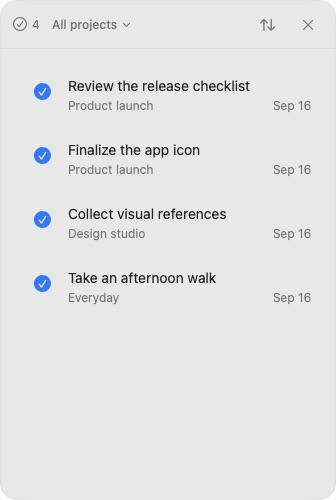
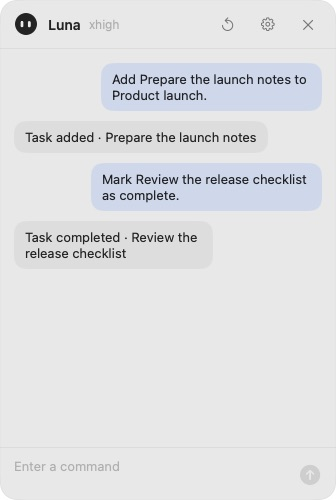
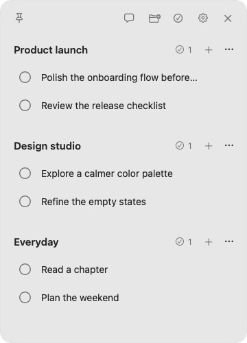
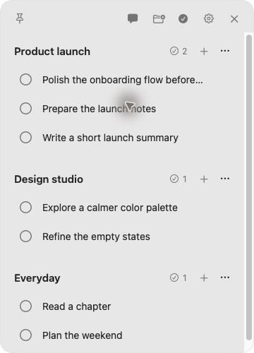
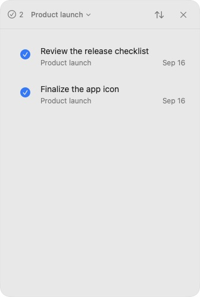
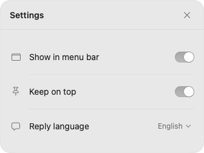
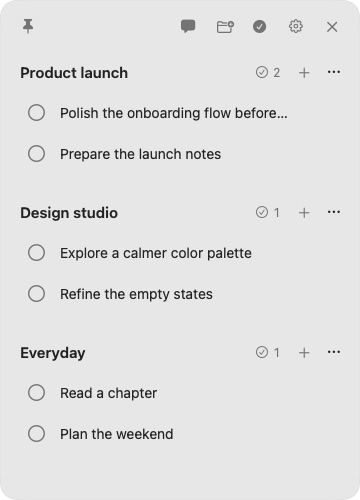
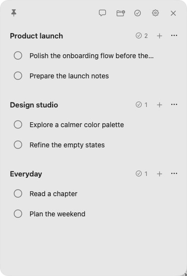

<p align="center">
  
</p>

<h1 align="center">FloatTask</h1>

<p align="center">
  A minimal, native macOS task panel.<br>
  Projects and tasks, always within reach.
</p>

<p align="center">
  <strong>English</strong> · <a href="README.ko.md">한국어</a>
</p>

<p align="center">
  <a href="#getting-started">Get started</a> ·
  <a href="#features">Features</a> ·
  <a href="#cli--automation">CLI</a> ·
  <a href="#development">Development</a>
</p>

<p align="center">
  
  
  
</p>

<p align="center"><sub>Completion history · Codex chat · Tasks<br>Real native window captures, arranged side by side. Sample data throughout.</sub></p>

FloatTask keeps a short task list beside the current workspace. Pin it above other apps, move it between projects, or tuck it away with a menu bar click. Completed work leaves the main list without losing its history.

Built with **SwiftUI + AppKit**, backed by a **local JSON file**, and paired with **`floattaskctl`** so the desktop app and scripts share the same data. Core task management needs no account or network connection.

## Features

### Chat beside your tasks

Open the chat bubble to bring up a separate side panel. Add a task, mark another complete, or ask what remains without leaving the task list. The conversation below uses the real Codex integration with a sample project.

<p align="center">
  
  
</p>

Chat and completion history can stay open at the same time. Each panel has its own close control; opening Settings does not replace either panel. [Chat setup and privacy details ↓](#codex-chat)

### Quick task capture

Create projects, edit titles in place, and press Enter to continue with the next task. Long titles stay compact with word-aware truncation and expand on hover. A reserved action area keeps the text width stable.

<p align="center">
  
  
</p>

<p align="center"><sub>A compact list and the next task added in place.</sub></p>

### Completion history, by project

Completed work leaves the main list and remains available in its own side panel. Filter by project, sort by **Recently completed** or **Date added**, and click a checkmark to reopen a task.

<p align="center">
  
  
</p>

<p align="center"><sub>All projects on the left; Product launch only on the right.</sub></p>

### Three settings, one small panel

The gear in the main window or beside Chat's reset button opens the same compact Settings panel. **Show in menu bar** enables one-click hide/show. **Keep on top** controls the pin. **Reply language** switches future replies between Korean and English. Changes save immediately.

<p align="center">
  
  
</p>

### A flexible native window

Resize the panel to fit the workspace; its position and size are remembered. Pin it across Spaces or switch to a regular Dock and Mission Control window. The interface follows the system's light or dark appearance, with native fonts, SF Symbols, accessibility labels, and Reduce Motion support.

<p align="center">
  
</p>

<p align="center"><sub>A taller task panel with Keep on top enabled.</sub></p>

The [shared CLI](#cli--automation) provides the same task operations for scripts. [Google Tasks](#google-tasks) is a manual CLI integration; it does not add a separate in-app screen.

## Getting started

### Requirements

- **macOS 14 or later**.
- An Apple developer toolchain providing the macOS SDK and **Swift 6.1** for the validated build setup. The package uses Swift 5 language mode.
- **Optional:** a compatible, authenticated Codex CLI for chat. The task panel works without it.

### Build from source

```bash
git clone https://github.com/EunHyeokJung/FloatTask.git
cd FloatTask
./scripts/build-app.sh
open dist/FloatTask.app
```

The build produces:

- `dist/FloatTask.app` — the macOS application.
- `dist/floattaskctl` — the command-line interface.

The app can also be copied into Applications using Finder. The build script creates a local **ad-hoc signature**, not a Developer ID–signed or notarized distribution. These instructions build locally; they do not depend on a prebuilt release.

### Everyday use

1. Add a project with the folder-plus button, then add tasks with the project's **+** button.
2. Click a title to edit it. Enter saves a task and starts the next input row.
3. Complete a task with its circle. Open its history through the project's completed count or the header's check-circle button.
4. Use the pin to switch window modes. Drag the empty header area to move the window; drag an edge or corner to resize it.
5. Enable **Show in menu bar** in Settings for one-click hide/show. Open side panels return with the main window. The header's **X quits the app**; it is not the hide button.

| Shortcut | Action |
| :--- | :--- |
| `⌘N` | Add a task to the first project |
| `⌘⇧N` | Add a project |
| `⌘⇧C` | Open completed tasks |
| `⌘,` | Open Settings |
| `Esc` | Dismiss a side panel or cancel new-task entry |

## Codex chat

Authenticate the installed Codex CLI, then open the chat bubble in FloatTask:

```bash
codex login
```

Example requests:

> Add “Review the release checklist” to Product launch.
>
> Mark “Finalize the app icon” as complete.
>
> Show the remaining tasks in Design studio.

The app requests **`gpt-5.6-luna`** with **`xhigh`** reasoning. The installed CLI and account must support that model and the flags used by the integration. These values are currently fixed in [`CodexTaskAgent.swift`](Sources/FloatTaskCore/CodexTaskAgent.swift), not configurable in Settings. A custom executable can be supplied through `FLOATTASK_CODEX_PATH` in the app's launch environment.

Chat replies default to **Korean**, with **English** available in Settings. Fixed interface labels stay English; project names and task titles retain their original language. Stop cancels the current request. Reset clears chat history without deleting tasks. Chat history is kept in memory and does not survive quitting the app.

### Data and privacy

- The task store is local. Using chat sends the request, current project/task context, and up to 16 recent chat messages through the configured Codex service; chat is **not an offline feature**.
- Codex runs in a read-only, ephemeral session. Structured changes are validated by the app and applied together through the shared store. Deletions require explicit deletion intent in the request.
- App preferences use macOS UserDefaults. The default task file is:

  ```text
  ~/Library/Application Support/FloatTask/tasks.json
  ```

- Back up that file to preserve projects and tasks. For experiments, set `FLOATTASK_DATA_FILE` or use the CLI's `--data-file` option to isolate data from the normal store.

## CLI & automation

The app and CLI use the same domain model and file-locking store. CLI changes appear in the running app automatically, usually within about a second.

```bash
# Inspect projects and their IDs.
./dist/floattaskctl projects list --json

# Create a project.
./dist/floattaskctl project add --title "Product launch" --json

# Replace the quoted placeholders with IDs returned by the CLI.
./dist/floattaskctl task add --project "<project-id>" --title "Review the checklist" --json
./dist/floattaskctl task complete "<task-id>" --json
./dist/floattaskctl task reopen "<task-id>" --json
./dist/floattaskctl task rename "<task-id>" --title "Review the final checklist" --json

# Display the full command reference.
./dist/floattaskctl help
```

Full UUIDs and unambiguous ID prefixes are accepted. Use `--json` for automation. Project and task deletion are also available through `project delete` and `task delete`.

An isolated example store can be created without touching normal tasks:

```bash
demo_dir=$(mktemp -d)
./dist/floattaskctl --data-file "$demo_dir/tasks.json" project add --title "Demo" --json
./dist/floattaskctl --data-file "$demo_dir/tasks.json" dump
```

## Google Tasks

Google Tasks sync is an **optional, manual CLI integration**. Provide a valid OAuth access token with the `https://www.googleapis.com/auth/tasks` scope through the `GOOGLE_TASKS_ACCESS_TOKEN` environment variable, then run:

```bash
./dist/floattaskctl google sync --json
```

FloatTask does not persist the access token. Sync can create Google lists for local projects, import remote lists and tasks, and merge mapped tasks using update timestamps. Back up the local store before the first sync; this command can modify both local and Google data.

**Current limits:** no built-in browser sign-in, automatic token refresh, scheduled sync, or automatic propagation of remote deletions. Browser OAuth is tracked in the [roadmap](docs/todo/00-todo-list.md).

## Development

```bash
swift test
./scripts/build-app.sh
codesign --verify --deep --strict dist/FloatTask.app
```

AppKit UI tests require a macOS graphical session. Tests cover the shared store, task actions, agent cancellation, text expansion, settings, panel layout, and the menu bar's hide/show lifecycle.

```text
Sources/
├── FloatTaskCore/    Domain model, storage, Codex and Google adapters
├── FloatTask/        Native macOS app
└── FloatTaskCLI/     floattaskctl
Tests/               Core and AppKit regression tests
docs/                Specifications, product scope, reports, and roadmap
```

No external Swift package dependencies are required. Both the app and CLI depend on `FloatTaskCore`; neither owns a separate storage format. The repository currently focuses on a personal Project → Task workflow, not team collaboration, calendars, or kanban boards.

Before contributing, read the [working agreement](AGENTS.md), [architecture](docs/01-folder-architecture.md), [specifications](docs/02-specs.md), and [product plan](docs/03-product-plan.md). Detailed project documents are currently maintained in Korean.

## Acknowledgements

The agent avatar adapts [Bloub](https://github.com/jeremy-prt/bloub). The documentation structure follows [Austin's Docs Architecture](https://github.com/EunHyeokJung/austin-docs-architecture). Their license texts are preserved in [Third-party notices](THIRD_PARTY_NOTICES.md) and included in the app bundle. These notices cover the respective third-party material, not a project-wide FloatTask license.
